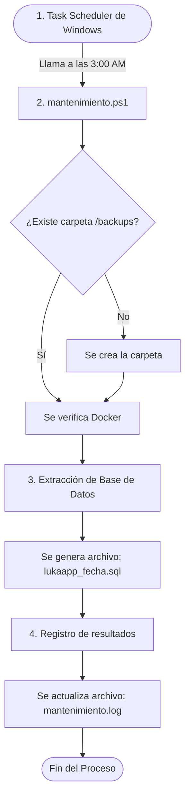

# Módulo de Mantenimiento

## 1. Introducción
El módulo de mantenimiento es una solución estratégica implementada para garantizar la integridad, disponibilidad y resiliencia de la plataforma. Dada nuestra arquitectura basada en microservicios, se requería un mecanismo centralizado que pudiera gestionar tareas críticas de respaldo sin interferir con las operaciones normales de los usuarios. Se implementó para asegurar que los datos estén siempre protegidos frente a cualquier eventualidad y para sentar las bases de futuras rutinas de limpieza y optimización del sistema.

## 2. Archivos y Documentos Creados (Componentes)
Para llevar a cabo este módulo, se diseñó e integró la siguiente estructura de archivos dentro del proyecto:

1.  **`mantenimiento.ps1` (Script Ejecutor):** Ubicado en `estructura-backend/scripts/`. Es el motor principal programado en PowerShell. Contiene toda la lógica para invocar comandos, capturar errores de Docker y asegurar que el proceso no se interrumpa.
2.  **Archivos `.sql` (Copias de Seguridad):** Archivos generados dinámicamente en la nueva carpeta `estructura-backend/backups/`. Cada archivo (ej. `lukaapp_2026-07-14_23-48-41.sql`) es el resultado de extraer toda la información de los microservicios usando `pg_dumpall`.
3.  **`mantenimiento.log` (Historial de Ejecución):** Un documento de texto plano autogenerado junto al script. Actúa como bitácora. El script escribe en él la hora de inicio, el nombre del archivo `.sql` creado, la duración en segundos y la hora de fin.
4.  **`CONFIGURACION_TASK_SCHEDULER.md` (Documentación de Automatización):** Un manual técnico ubicado en la carpeta `documentacion/`. Detalla paso a paso cómo usar el Programador de Tareas de Windows para que llame al archivo `mantenimiento.ps1` diariamente de forma automática (ej. a las 3:00 AM).

## 3. Flujo de funcionamiento e interacción de los archivos

**Paso a paso del flujo de los archivos:**
1.  **Activación:** El sistema operativo lee las instrucciones establecidas mediante la guía `CONFIGURACION_TASK_SCHEDULER.md` y dispara la ejecución del archivo `mantenimiento.ps1` sin intervención del usuario.
2.  **Preparación y Verificación:** El archivo `mantenimiento.ps1` arranca, verifica que la carpeta `backups` exista y confirma que el contenedor de PostgreSQL esté vivo.
3.  **Generación del Backup:** El script envía un comando interno al contenedor de base de datos para extraer los datos. El resultado directo de esto es la creación física de un nuevo archivo `.sql` en la carpeta de respaldos.
4.  **Cierre y Bitácora:** Inmediatamente después de guardar el `.sql`, el script abre el archivo `mantenimiento.log`, escribe una nueva línea indicando que el proceso fue exitoso (o si hubo un error) y finaliza.

## 4. Beneficios
*   **Seguridad de Datos:** Garantiza que siempre exista una copia reciente de toda la plataforma ante contingencias, corrupción de datos o fallas de infraestructura.
*   **Automatización "Zero-Touch":** Reduce drásticamente el trabajo manual y la probabilidad de error humano, operando en horarios de bajo tráfico sin requerir la atención de un administrador.
*   **Trazabilidad:** Gracias a los historiales, cualquier falla operativa o de conexión queda registrada para un diagnóstico y solución rápidos.
*   **Escalabilidad:** El módulo está diseñado por bloques. Hoy realiza copias de seguridad, pero su estructura permite agregar funciones para eliminar datos caducados o limpiar archivos temporales en el futuro sin modificar su núcleo.
*   **Portabilidad:** Su diseño desacoplado permite que el mantenimiento acompañe al proyecto a cualquier entorno sin importar dónde se despliegue.

## 5. Conclusión
La implementación del módulo de mantenimiento dota a la plataforma de una capa esencial de administración y protección proactiva. Al automatizar los respaldos de la arquitectura de microservicios y preparar el terreno para rutinas operativas complejas, se asegura un entorno estable, profesional y listo para escenarios reales de producción, cumpliendo de lleno con los estándares modernos de fiabilidad en el desarrollo de software.
